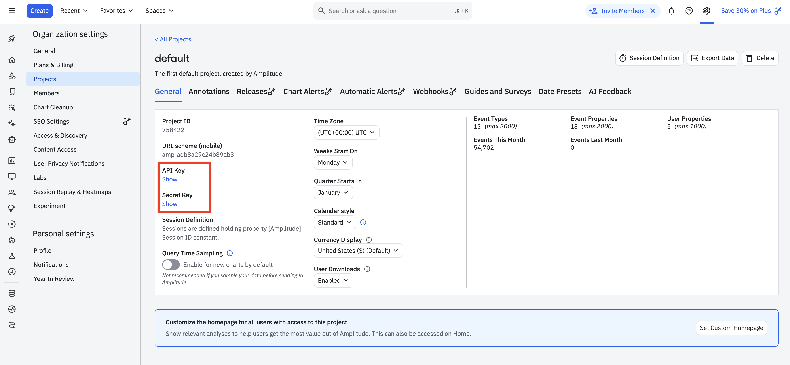
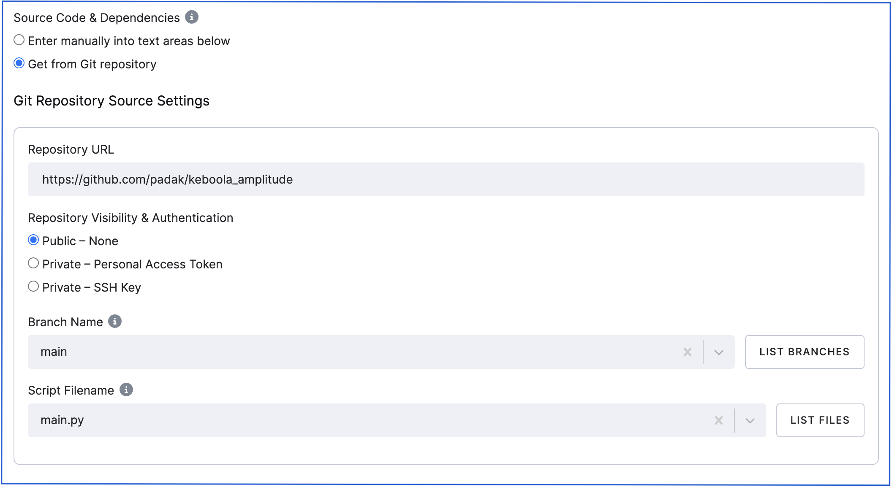
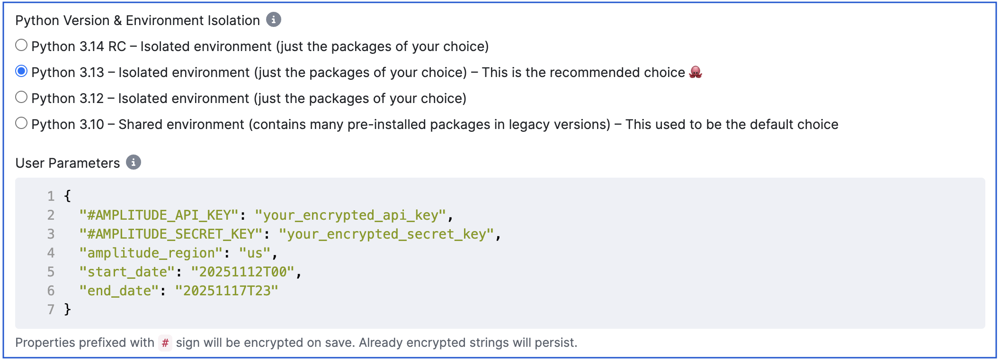
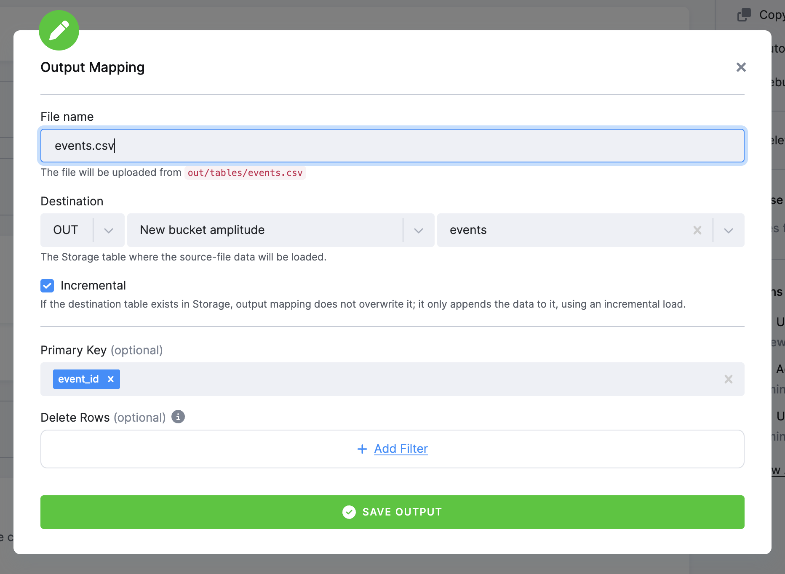

# Amplitude Connector: Built on Prometheus Driver System (Keboola)

Production-ready Python driver for exporting event data from Amplitude Analytics into Keboola Storage.

**Built on [Prometheus Driver System](https://www.keboola.com/) - Enterprise-grade data connector framework by Keboola**

---

## License

MIT License - See LICENSE file for details

## Features

- **Amplitude Export API** - Export raw event data
- **Automatic Compression Handling** - Handles gzip-compressed responses
- **Flexible Authentication** - API key and/or secret key support
- **Keboola Integration** - Custom Python component ready for deployment
- **Unit Tests** - Test suite for driver validation

## Setup

### 1. Get Amplitude Credentials

Go to your Amplitude project settings:
```
https://app.amplitude.com/analytics/{YOUR_ORG}/settings/projects/{PROJECT_ID}/general
```

You'll find:
- **API Key** - Used for reading data
- **Secret Key** - Required for Export API




## Usage

### Keboola Configuration

1. **Create Custom Python Component** in Keboola
2. **Set Git Repository:**
   - URL: `https://github.com/padak/keboola_amplitude.git`
   - Branch: `main`
   - Filename: `main.py`



3. **Set User Parameters:**
   ```json
   {
     "#AMPLITUDE_API_KEY": "your_encrypted_api_key",
     "#AMPLITUDE_SECRET_KEY": "your_encrypted_secret_key",
     "amplitude_region": "us",
     "start_date": "20251112T00",
     "end_date": "20251117T23"
   }
   ```
   > Parameters with `#` are encrypted by Keboola automatically



4. **Set Output Mapping:**
   - File: `events.csv` → Table: `out.c-amplitude.events`
   - Incremental: ✓ enabled
   - Primary Key: `event_id`



5. **Run** the component

